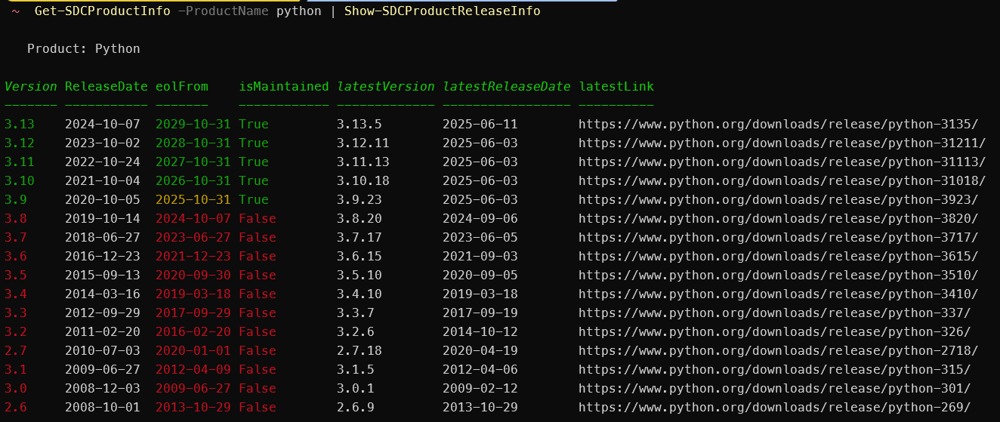

# SupportDeathClock

A PowerShell module which uses the [endoflife.date](https://endoflife.date/) api to report on product support dates for different version of a product.

If it's not obvious, this is still under development 😊

## v0.1.0

- Added custom formatter and datatypes for product release information
- Added function to export product and release information to markdown


## Installation

```powershell
Install-Module -Name SupportDeathClock
```

## Getting Started

The following are some examples of using the main commands

> **Note:** The commands now return all the same fields as the [EndOfLife API](https://endoflife.date/docs/api/v1/). See the schema section for more information about what each field means.

### Get-SDCAllProductInfo

This command uses the [https://endoflife.date/api/v1/products/full](https://endoflife.date/docs/api/v1/#/Products/products_full) end point and returns a list of all the products maintained in the endoflife.date data, including all releases. To reduce the amount of data transferred it is preferable to use `Get-SDCAllProductInfo`.

```powershell
Get-SDCAllProductInfo
```

### Get-SDCProductInfo

This command can be in the following ways

```powershell
# This will return information regarding all versions of a product, in this case python
# ProductName uses an ArgumentCompleter, so you will be able to use tab completion to see all the possible product names
Get-SDCProductInfo -ProductName python

```

```powershell
# This will return information regarding a specific versions of a product, in this case python version 3.5
# Release uses an ArgumentCompleter, so you will be able to use tab completion to see all the possible versions of the product
Get-SDCProductInfo -ProductName python -Release 3.5
```

```powershell
# This will return information regarding the latest versions of a product, in this case python.
Get-SDCProductInfo -ProductName python -Latest
```

### Show-SDCProductReleaseInfo

This command can be used with the output from the `Get-SDCAllProductInfo` and `Get-SDCProductInfo -ProductName xxx`. By default, it will show a custom formatter view of the release information for the product(s) passed in. You can use `Format-List *` to see all the properties of the object.

```powershell

Get-SDCAllProductInfo | Show-SDCProductReleaseInfo

# This will return information regarding all versions of python
Get-SDCProductInfo -ProductName python | Show-SDCProductReleaseInfo
```

Example Output:


### Export-SDCProductInfoAsmarkdown

This command can be used with the output from the `Get-SDCAllProductInfo` and `Get-SDCProductInfo -ProductName xxx` to produce Markdown files. The name of the markdown file will match the name of the product being passed in.

```powershell

Get-SDCAllProductInfo | Export-SDCProductInfoAsMarkdown -OutputPath "D:\Temp\SDC\"

```


### Get-SDCAllProductsByCategory

The endpoint only returns a limited set of data regarding each products. Useful for seeing which products are supported without having to return all the products. Categories include:

- app
- database
- device
- framework
- lang
- os
- server-app
- service
- standard

```powershell
# Returns a list of all the products available for a specific category
# Category uses an ArgumentCompleter, so you will be able to use tab completion to see all possible categories
Get-SDCAllProductsByCategory -Category os

name     : windows
aliases  : {}
label    : Microsoft Windows
category : os
tags     : {microsoft, os, windows}
uri      : https://endoflife.date/api/v1/products/windows
```

### Get-SDCAllProductsByTag

Similar to the `Get-SDCAllProductsByCategory` cmdlet. The endpoint only returns a limited set of data regarding each products.

```powershell
# Returns a list of all the products available for a specific tag
# Tag uses an ArgumentCompleter, so you will be able to use tab completion to see all possible Tags
Get-SDCAllProductsByTag -Tag microsoft

name     : windows
aliases  : {}
label    : Microsoft Windows
category : os
tags     : {microsoft, os, windows}
uri      : https://endoflife.date/api/v1/products/windows
```

### Get-SDCProductReleaseNumber

Returns a list of all available Releases for a product

```powershell
# ProductName uses an ArgumentCompleter, so you will be able to use tab completion to see all the possible product names
Get-SDCProductReleaseNumber -ProductName flux

Release
-------
2.6
2.5
2.4
2.3
2.2
2.1
2.0
1.25

```
